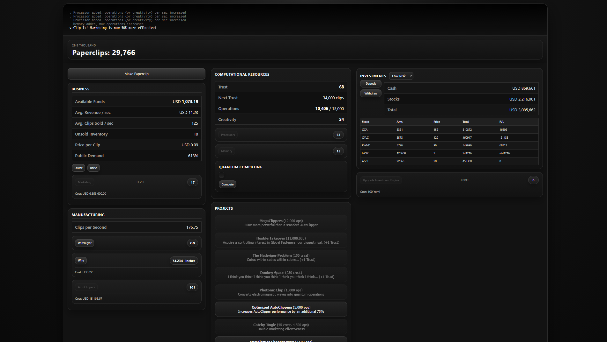

# Universal Paperclips GUI

A graphical user interface adaptation of **Universal Paperclips**.

This repository does **not** contain an original game created by me.  
My contribution is limited to adding a **graphical GUI** to the existing game.
The screenshot above is created using cheats and is purely demonstrative.

## About the Original Game

**Universal Paperclips** is the original work of **Frank Lantz** and **Bennett Foddy**.  
All original concepts, mechanics, code, and intellectual property related to the game belong to the original author and respective rights holders.

## My Contribution

What I added in this version:

- A graphical user interface
- Visual changes to improve interaction and presentation
- No claim of authorship over the original game itself

## Disclaimer

I do **not** own **Universal Paperclips**, and I claim **no rights** over the original game code, concept, or assets.  
This repository is only a GUI adaptation of the original project and is intended for educational, experimental, or preservation purposes.

## Credits

- **Original game:** Frank Lantz, Bennett Foddy
- **GUI adaptation:** Teo Toscano (northumber)

## Rights Notice

If you are the original author or rights holder and want this repository modified or removed, please open an issue or contact me directly.
